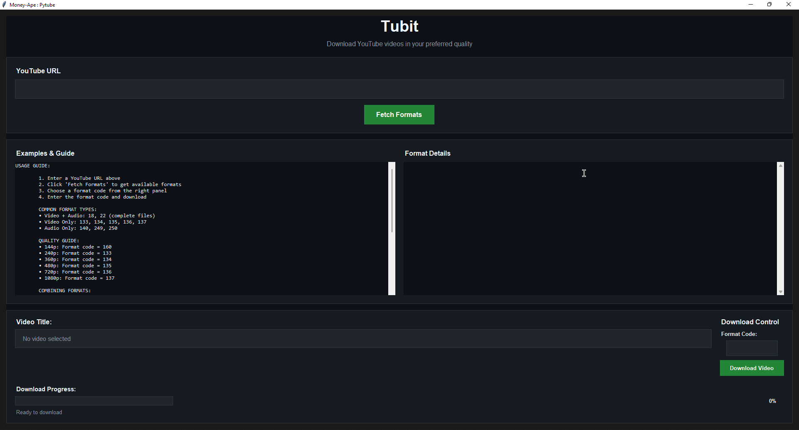
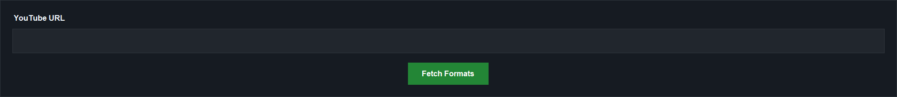
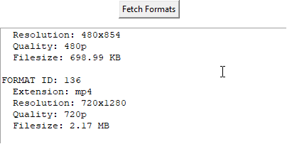
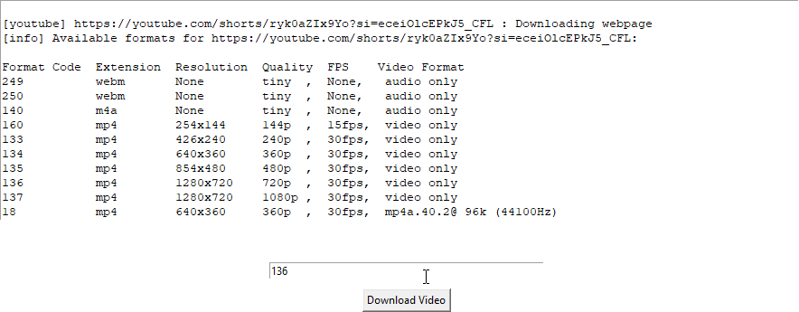

# 🎞️ Pytube Pro

**Pytube Pro** is a Python-based desktop tool to automatically download YouTube videos with the best available formats in real-time using `yt-dlp` and `ffmpeg`.

---

## ✨ Features

- Automatically fetches available video/audio formats.
- Provides real-time best format detection.
- Simple and easy-to-use desktop GUI.
- Supports multiple resolutions and formats (currently under maintenance for 2K, 4K, 8K).

---

## 🧩 Tech Stack

- **Language**: Python
- **GUI**: tkinter
- **Video Library**: [yt-dlp](https://github.com/yt-dlp/yt-dlp)
- **Media Processing**: [ffmpeg](https://ffmpeg.org/)

---

## 🖥️ How to Use

1. **Run** `pytube-pro.py` as an Administrator.

   

2. **Paste the YouTube video URL** in the input box.

   

3. **Click on "Fetch Formats"** to list the available video/audio formats.

   

4. **Choose the desired format**, then click on **Download Video**.

   

---

## 🧪 Under Development

- Enhanced support for **2K, 4K, and 8K** formats is in progress.
- More format filters and intelligent auto-selection will be added soon.

---

## 🔧 Requirements

- Python 3.7+
- `yt-dlp` and `ffmpeg` must be installed and accessible via system PATH

### 📥 Download ffmpeg

To use `ffmpeg`, download the latest stable release from the official website:

➡️ [FFmpeg : ](https://ffmpeg.org/releases/ffmpeg-7.1.1.tar.xz)

> After downloading, extract the archive and add rename it to `ffmpeg` so that it can be used from the terminal.
⚠️ `ffmpeg` file should be in the same directory as `pytube-pro.py`.

⚠️ **Do not upload `ffmpeg` executable files to the GitHub repository.**  
They are large and exceed GitHub's 100MB file size limit. Always recommend to download them separately.

---

## 📜 License

For personal/small-scale distribution, **MIT License** is recommended.  
To use yt-dlp and ffmpeg, ensure their respective licenses (e.g., LGPL/GPL for ffmpeg) are followed.

---

## 🙏 Credits

- **yt-dlp** – A YouTube video downloading library for Python  
  🔗 https://github.com/yt-dlp/yt-dlp

- **ffmpeg** – A complete, cross-platform solution to record, convert and stream audio and video  
  🔗 https://ffmpeg.org

---

## 📢 Note

> Stay tuned for more updates!  
> Hope to develop a full-fledged working Desktop software.
> Platform : Linux {Under Development}
---

## 🧑‍💻 Developed by

**Lovepreet Singh aka Money-Ape**  
GitHub: [Money-Ape](https://github.com/Money-Ape)
